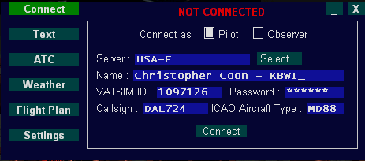

# VatConnect FSX Pilot Client

Project currently under development (not all features implemented yet). Project files are for compiling with MS Visual Studio 2015 (free Community edition is used here).

# Description

VatConnect is an add-on for FSX that connects it to the Vatsim flight simulation network (vatsim.net). There are plans to support other flight simulators in the future. The main differences with other existing Vatsim pilot clients include:

-- Except for the server communications, which are proprietary and covered by Vatsim NDA, the rest of the project is open-sourced to allow continued development. 

-- GUI is visible in both windowed and fullscreen FSX modes.

-- Minimized mode included with automatic text radio monitoring. One of the requirements on Vatsim is to continually monitor unicom for text messages if not under ATC control, and continually monitor ATC text messages even if using voice communication. This can take up unwanted screen space if monitored manually, so VatConnect includes a minimized mode which reduces the GUI to a very small rectangle that can be dragged off to a corner. A single "LED" light shows the connection status (red or green), whether there is text message activity (the LED blinks), and if the text message refers to the user's callsign, a tone will sound to alert the user, and/or the full text message window will pop open. 

-- Unicode support for text messages.

-- Real-time updates, ground clamping, and accurate light, flap and gear status for others with compatible clients. This means proper formation flying is possible, as you see the "current" position of aircraft instead of where they were 5 seconds ago (such as with some other clients). Ground clamping means pilots using different sceneries than your own will properly show them taxiing on the ground instead of suspended in the air. 

# Architecture Overview

There are two modules associated with VatConnect: The GUI which runs as a DLL add-on to FSX, and the server interface which is launched by the GUI and runs as a standalone .EXE. The modules communicate by sending packets defined in packets.h to each other via loopback (using UDP, in the utility classes CPacketSender and CPacketReceiver).

The GUI module draws a GUI to a GDI surface using standard GDI calls, using its own widgets to draw buttons, checkboxes, edit boxes, scroll bars, etc. It then overlays this onto FSX's Direct3D backbuffer at each frame. To prevent loss in framerate, it stores a copy of its output surface as a Direct3D surface in graphic card memory, and uses "dirty rectangle" techniques to only update the surface when something changes. This means the actual overlaying of the surface each FSX drawing frame is a simple blit from within graphic card memory.

The GUI gets access to FSX's back buffer by creating a new Direct3D object, which because the DLL is running in the same process as FSX, ultimately points to the same virtual table as the already-loaded DirectX dll. It overwrites the "Present" entry in the virtual table (the method called after FSX has finished rendering to the back buffer and wants to present it) to point to a local function, which blits the GUI output surface directly onto the back buffer, then calls the "real" Present method.

Likewise the GUI intercepts FSX's windows message loop with SetWindowLongPtr, to first check if a mouse click or keyboard entry applies to the GUI. If not, it forwards it and the rest of the windows messages on to FSX.

The code to hook into DirectX, the message loop, and communicate to FSX through the SimConnect library is in GUI-FSX.cpp; The GUI widgets/controls and drawing library that wraps GDI is in C2DGraphics and Controls.cpp; dlgMain, dlgFP, etc handle drawing and input for each of the different dialogs depending on which one is currently selected (dlgMain represents the entire dialog and has "page select" buttons that select sub-dialogs like flight plan entry, login page, server select sub-page, etc. But dlgMain is the top-level dialog and the others call back to that); CFSXObjects is a singleton that manages adding/updating/deleting aircraft messages coming from the server and interpolating them and updating them each FSX frame within FSX. It uses the CFSXModelResolver singleton to pick the "best" installed 3D model in the user's FSX installation, given an ICAO aircraft type (it uses the utility CParser class to parse FSX aircraft files); CPacketSender sends a Packets.h packet to the UDP port the server interface .exe is listening to, and CPacketReceiver receives packets from the server interface. 

The GUI's main loop is driven by a subscription to Simconnect's "FRAME" event, which calls back to the DLL in GUI-FSX.cpp SimconnectDispatch function (event = SIMCONNECT_RECV_ID_EVENT_FRAME) each FSX "simulation frame" (not drawing frame). In that event, 
the GUI is updated, the object manager is updated, and the packet receiver is polled and processes any inbound packets. The DLL is also called at each FSX drawing frame through the "Present" function intercept as described above, but the DLL just blits its current output surface and returns. Likewise, the DLL is called when there is a Windows message (from the Windows hook described above, found in CFSXGUI::FSXWndProc), which gets forwarded to the main dialog WindowsMessage() (and in turn forwards it to its sub-dialogs). If none of them process the message, it's forwarded to the next Windows message handler in the chain (likely FSX).

--------------------

Server Interface: The "server sim" .exe in this project does NOT connect to Vatsim; instead it uses the same protocol with the GUI to simulate things locally for test purposes. It moves around dummy aircraft, sends dummy radio messages, etc to allow GUI development without need for VatSim approval, a network connection, or having to sign any NDA's. A closed-source "Vatsim Proxy.exe" is currently under development and will be available with the first release of this project. The GUI just has to launch the Vatsim Proxy instead of the Server Sim to actually connect to Vatsim (although it will require Vatsim approval, and they will issue a client ID and authentication key that needs to be provided to the Vatsim Proxy interface on login).

